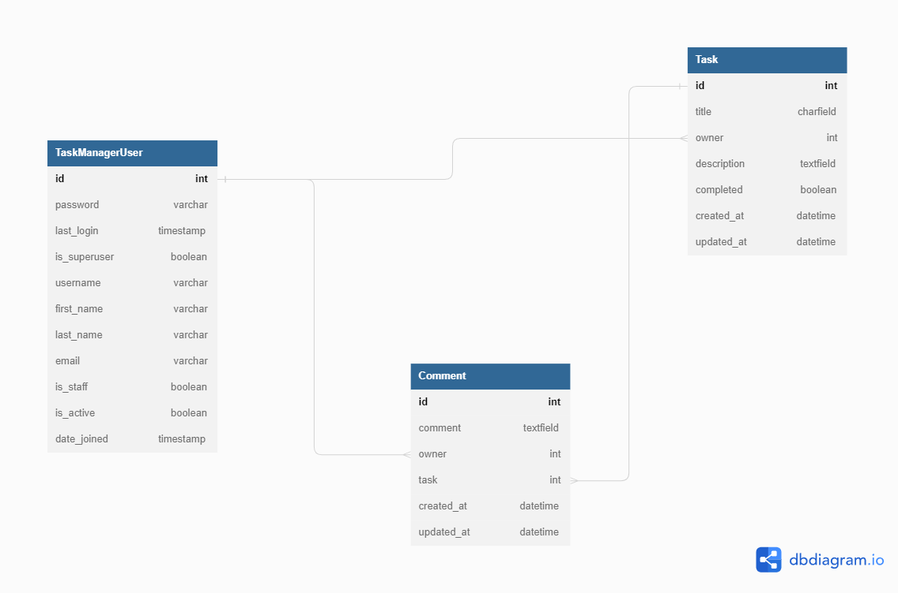
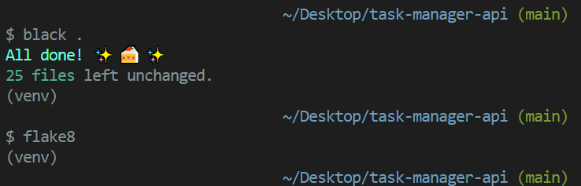

# Task Manager API 
Task Manager API is the backend service used by the Task Manager application 

## Table of Contents 
* [Development goals](#development-goals) 
* [Agile planning](#agile-planning)
    * [Epics](#epics)
    * [User stories](#user-stories)
* [API endpoints](#api-endpoints)
* [Database design](#database-design)
* [Technologies](#technologies)
    * [Python Packages](#python-packages)
* [Testing](#testing)
    * [Postman setup](#postman-setup)
    * [Testing API in Postman](#testing-api-in-postman)
        * [Creating a user ](#creating-a-user)
        * [Login in ](#login-in)
        * [Important step for testing ](#important-step-for-testing)
        * [Tasks](#tasks)
        * [Comments](#comments)
* [Deployment](#deployment)
    * [Version Control](#version-control)
    * [Heroku Deployment](#heroku-deployment)
    * [Virtual Environment Setup](#virtual-environment-setup)
    * [Clone the Repository locally](#clone-the-repository-locally)
* [Credits](#credits)
## Development goals
This API aims to provide a backend service to allow the Task Manager frontend application to create, update, delete, store and manipulate data.

## Agile planning 
The project was developed by using agile methodologies. The development cycle was divided into five sprints, where code was delivered in small chunks for flexibility and good coding practice.

The Kanban board was created to keep track of project progression and task assessment. Tasks were given acceptance criteria. In addition, they were marked with labels and assigned to project epics.
### Epics 
1. Setup
The base setup epic is for all stories needed for the base setup of the application. Without initial steps, the development of the application would not be possible under the given conditions and constraints.

2. Prototype
The prototype epic is for all stories needed to create an application prototype. Creating a prototype was an essential step of development, allowing new functionalities to be implemented and tested in a risk-free environment.

3. Profiles
The profiles epic is for all stories related to the creation of user profiles (accounts) and user authentication.

4. Tasks
The tasks epic is for all stories related to tasks. Tasks are core content that the user can view and interact with.

5. Comments
The epic cover the user stories related to creating, editing, updating and deleting comments

6. Deployment 
This epic is for deployment-related stories. Hosting a site on Heroku allows connecting the backend to the frontend application.

7. Documentation
This epic is for document-related stories. It provides essential documentation to give an insight into the development process and explain all stages of the software production cycle.

[Back to Table of contents](#table-of-contents)

### User stories 

1. Setup
- As a developer, I have to use linting tools, so my code follows the pep8 standard
- As a developer, I need to set up the project with the core requirements so that I can work on the project

2. Prototype
- As a developer, I need to set up a local database to work with it and correct potential mistakes before committing changes to a remote database
- As a developer, I need to install and configure a tool to test various requests to the backend without the frontend application

3. Profiles
- As a user, I  want to be able to create a profile (account)
- As a user, I want to sign in and sign out of the service

4. Tasks
- As a user, I want to be able to view, edit or delete a task
- As a user, I want to be able to create and view all tasks

5. Comments
- As a user, I want to be able to view, edit or delete a comment
- As a user, I want to be able to create a comment

6. Deployment
- As a developer, I have to deploy the project so the users can visit the frontend application and interact with the content.
- As a developer, I need to deploy my project to Heroku, so the deployed frontend application can access a remote database

7. Documentation 
- As a developer, I need to write README.md so others can check the documentation and gain a better understanding of application principles

[Back to Table of contents](#table-of-contents)
### API Endpoints
User story: 

`As a user, I  want to be able to create a profile`

Implementation: 

Endpoint: api/profiles/create-user

Methods: 
POST: used to create user profile

User story: 

`As a user, I want to sign in and sign out of the service`

Implementation: 


Endpoint: api/profiles/token

Endpoint: api/profiles/token/refresh

Methods: 
POST: used for obtaining access and refresh tokens

User story: 

`As a user, I want to be able to create a comment`

Implementation:

Endpoint: api/tasks/int_pk/comments

Methods: 
POST: used for creating a comment

User story:

`As a user, I want to be able to view, edit or delete a comment`

Implementation:

Endpoint: api/tasks/task_pk/comments/int_pk

Methods: 
GET: used to retrieve comment
PUT: used to update a comment
DELETE: used to remove comment

User story: 

`As a user, I want to be able to create and view a all tasks`

Implementation:

Endpoint: api/tasks/

POST: used for creating a task
GET: used for retrieving all tasks

User story :

`As a user, I want to be able to view, edit or delete a task`

Implementation:

Endpoint: api/tasks/task_pk

GET: used for retrieving a task
PUT: used for updating a task
DELETE: used for removing a task

[Back to Table of contents](#table-of-contents)

## Database Design


## Technologies
* Django
    * main framework used to start a project
* Django REST
    * main framework for building API endpoints
* Postman 
    * Prototyping, building and testing API
* Heroku
    * Application hosting
* Git
    * Version control
* Github
    * source code repository
* Visual Studio Code
    * The website was written in Visual Studio Code IDE
* pgAdmin
    * Local database management 
* DBeaver 
    * remote database management
* [Dbdiagram](https://dbdiagram.io)
    * database diagram
## Python Packages

* black==23.1.0
    * Linting tool
* Django==4.1.5
    * Framework used to build an application
* django-cors-headers==3.13.0
    * adding Cross-Origin Resource Sharing (CORS) headers to responses. 
* djangorestframework==3.14.0
    * framework for building API
* djangorestframework-simplejwt==5.2.2
    * token generation
* cloudinary==1.31.0
    * part of early design
* dj-database-url==1.2.0
    * used to parse database url for production environment
* isort==5.12.0
    * sorting imports
* flake8==6.0.0
    * checking code against PEP8 standard
* psycopg2==2.9.5
    * Heroku deployment requirement
* gunicorn==20.1.0
    * Python WSGI HTTP Server for UNIX, that supports WSGI and Django
* whitenoise==6.3.0
    * allows web application to serve own static files. 

Installed as package dependencies with the above installations:
* asgiref==3.6.0
* charset-normalizer==3.0.1
* tzdata==2022.7
* urllib3==1.26.14
* requests==2.28.2
* six==1.16.0
* sqlparse==0.4.3
* certifi==2022.12.7
* pytz==2022.7.1
* idna==3.4
* platformdirs==2.6.2
* mccabe==0.7.0
* mypy-extensions==0.4.3
* packaging==23.0
* pathspec==0.11.0
* pyflakes==3.0.1

[Back to Table of contents](#table-of-contents)
## Testing 

User story : 
`As a developer, I need to install and configure a tool to test various requests to the backend without the frontend application`

Implementation: 

Postman software was used during development process for prototyping and testing.
### Postman setup 

1. Click Environments tab
1. Create Local_ENV environment 
1. Create three variables : 
* BASE_URL with initial value: `http://127.0.0.1:8000/`
* JWT_TOKEN
* JWT_REFRESH
1. Create POST request jwtToken to `{{BASE_URL}}api/profiles/token/`
1. In the Tests tab add : 
* `var jsonData = JSON.parse(responseBody);` 
* `pm.environment.set("JWT_TOKEN", jsonData.access);`
* `pm.environment.set("JWT_REFRESH", jsonData.refresh);`
1. Create POST request jwtToken to `{{BASE_URL}}api/profiles/token/refresh/`
1. In the Tests tab add :
* `var jsonData = JSON.parse(responseBody);`
* `pm.environment.set("JWT_TOKEN", jsonData.access);`

[Back to Table of contents](#table-of-contents)

### Testing API in Postman 
#### Creating a user 

1. Scenerio 1 : User tries to create an account with a username that does not exist.

* Create a POST request to `{{BASE_URL}}api/profiles/create-user/`
*  In the Body tab add : 
`{
    "username": "mytestuser",
    "password": "testtest"
}`
*  Click Send button
* The server responds with status 201.

1. Scenario 2 : User tries to create an account with a username that already exists.

*  Create a POST request to `{{BASE_URL}}api/profiles/create-user/`
*  In the Body tab add : 
`{
    "username": "mytestuser",
    "password": "testtest"
}`
* Click Send button
* The server responds with status 400.

[Back to Table of contents](#table-of-contents)
#### Login in 

1. Scenario 1:  User tries to login with correct credentials

* Create a POST request to `{{BASE_URL}}api/profiles/token/`
*  In the Body tab add : 

`{
    "username": "mytestuser",
    "password": "testtest"
}`

* Click Send button 
* Server responds with status 200.

2. Scenario 2:  User tries to login with incorrect credentials

* Create a POST request to `{{BASE_URL}}api/profiles/token/`
*  In the Body tab add : 

`{
    "username": "mytestuser",
    "password": "test"
}`

* Click Send button 
* Server responds with status 401

3. Scenario 3:  User tries to refresh his token

*  Create a POST request to  `{{BASE_URL}}api/profiles/token/refresh`
* In the Body tab add : 

`{
    "refresh": "{{JWT_REFRESH}}"
}
` 

* Click Send button
* Access Token is refreshed

4. Scenario 4: User tries to refresh token without login in 

* Create POST request to `{{BASE_URL}}api/profiles/token/`
*   In the Body tab add : 

`{
    "username": "mytestuser",
    "password": "test"
}`

* Click send button 

* USE a POST request to `{{BASE_URL}}api/profiles/token/refresh` with a body : 

`{
    "refresh": "{{JWT_REFRESH}}"
}
` 
* Click Send button
* Server responds with status 401

[Back to Table of contents](#table-of-contents)

##### Important step for testing 

In all requests below, it is essential to take an additional step, that is described below:
*  In the Headers tab add 
`Key : Authorization` with value `Bearer  {{JWT_TOKEN}}`

#### Tasks

1. Scenario 1 : User is logged in and tries to access all tasks
* Login with correct credentials by POST request to `{{BASE_URL}}api/profiles/token/`
* Create a request to `{{BASE_URL}}api/tasks/` with GET method
* Click a Send button
* Server responds with status 200

2. Scenario 2 : User is not logged in and tries to access all tasks
* Login with incorrect credentials by POST request to `{{BASE_URL}}api/profiles/token/`
* Create a request to `{{BASE_URL}}api/tasks/` with GET method
* Click a Send button
* Server responds with status 401

3. Scenario 3: User is logged in and tries to create a new task

* Login with correct credentials by POST request to `{{BASE_URL}}api/profiles/token/`
* Create a POST request to `{{BASE_URL}}api/tasks/` 
* In Body section add : 

`{
    "title": "test",
    "description": "test"
}`

* Click Send button 
* Server responds with status 201

4. Scenario 4: User is not logged in and tries to create a new task 

* Login with incorrect credentials by POST request to `{{BASE_URL}}api/profiles/token/`
* Create a POST request to `{{BASE_URL}}api/tasks/` 
* In Body section add : 

`{
    "title": "test",
    "description": "test"
}`

* Click Send button
* Server responds with status 401

5. Scenario 5: User is logged in and tries to create a task without a title
* Login with correct credentials by POST request to `{{BASE_URL}}api/profiles/token/`
* Create a POST request to `{{BASE_URL}}api/tasks/` 
* In Body section add : 

`{
    "description": "test"
}`

* Click Send button
* Server responds with status 400

6. Scenario 6: User is logged and tries to delete his own task 

* Login with correct credentials by POST request to `{{BASE_URL}}api/profiles/token/`
* Create a DELETE request to `{{BASE_URL}}api/tasks/task_id`
* Click Send button
* Server responds with status 204

7. Scenario 7: User is logged in and tries to delete not his task 
* Login with correct credentials by POST request to `{{BASE_URL}}api/profiles/token/`
* Create a DELETE request to `{{BASE_URL}}api/tasks/not_user_task_id`
* Click Send button
* Server responds with status 403

8. Scenario 8: User is logged in and tries to delete a task that does not exist
* Login with correct credentials by POST request to `{{BASE_URL}}api/profiles/token/`
* Create a DELETE request to `{{BASE_URL}}api/tasks/task_id`
* Click Send button
* Server responds with status 404


9. Scenario 9: User is not logged in and tries to delete a task

* Login with incorrect credentials by POST request to `{{BASE_URL}}api/profiles/token/`
* Create a DELETE request to `{{BASE_URL}}api/tasks/task_id`
* Click Send button
* Server responds with status 401

10. Scenario 10: User is logged in and tries to update his own task 

* Login with correct credentials by POST request to `{{BASE_URL}}api/profiles/token/`
* Create a PUT request to `{{BASE_URL}}api/tasks/task_id`
* In the Body add: 

`
{
    "title": "test_1"
}
`

* Click Send button
* Server responds with status 200

11. Scenario 11: User is logged in and tries to update his own task without a title

* Login with correct credentials by POST request to `{{BASE_URL}}api/profiles/token/`
* Create a PUT request to `{{BASE_URL}}api/tasks/task_id`
* Leave Body tab empty
* Click Send button
* Server responds with status 400

12. Scenario 12: User is logged in and tries to update not his task 

* Login with correct credentials by POST request to `{{BASE_URL}}api/profiles/token/`
* Create a PUT request to `{{BASE_URL}}api/tasks/not_user_task_id`
* In the Body add :

`
{
    "title": "test_1"
}
`

* Click Send button 
* Server responds with status 403

14. Scenario 11: User is not logged in and tries to update a task 

*  Login with incorrect credentials by POST request to `{{BASE_URL}}api/profiles/token/`
*  Create a PUT request to `{{BASE_URL}}api/tasks/task_id`
* In the Body add : 

`
{
    "title": "test_1"
}
`

* Click Send button 
* Server responds with status 401

15. Scenario 15: User is logged in and tries to update a task that does not exist
* Login with correct credentials by POST request to `{{BASE_URL}}api/profiles/token/`
* Create a PUT request to `{{BASE_URL}}api/tasks/not_user_task_id`
* In the Body add :

`
{
    "title": "test_1"
}
`
* Click Send button
* Server responds with status 404

[Back to Table of contents](#table-of-contents)

#### Comments

1. Scenario 1: User is logged and tries add a comment to the task that exists
* Login with correct credentials by POST request to `{{BASE_URL}}api/profiles/token/`
* Create POST request to `{{BASE_URL}}api/tasks/task_id/comments`
* In the Body add : 

`{
    "task_id": 1,
    "comment": "comment"
}`

* Click Send button
* Server responds with status 201

2. Scenario 2: User is logged in and tries to add a comment to the task that does not exist
* Login with correct credentials by POST request to `{{BASE_URL}}api/profiles/token/`
*  Create POST request to `{{BASE_URL}}api/tasks/not_task_id/comments`
* In the Body add: 

`{
    "comment": "comment"
}`
* Click Send button
* Server responds with status 500, since it violates a foreign key constraint

3. Scenario 3: User is not logged in and tries to add a comment

* Login with incorrect credentials by POST request to `{{BASE_URL}}api/profiles/token/`
* Create POST request to `{{BASE_URL}}api/tasks/task_id/comments`
* In the Body add: 

`{
    "task_id": 1,
    "comment": "comment"
}`

* Click Send button
* Server responds with status 401

4. Scenario 4: User is logged in and tries to add an empty comment

* Login with correct credentials by POST request to `{{BASE_URL}}api/profiles/token/`
* Create POST request to `{{BASE_URL}}api/tasks/task_id/comments`
* In the Body add: 

`{
    "task_id": 1,
}`

* Click Send button
* Server responds with status 400

5. Scenario 5: User is logged in and tries to delete his own comment 

* Login with correct credentials by POST request to `{{BASE_URL}}api/profiles/token/`
* Create DELETE request to `{{BASE_URL}}api/tasks/task_id/comments/comment_id`
* Click Send button
* Server responds with status 204

6. Scenario 6: User is logged in and tries to delete not his comment

* Login with correct credentials by POST request to `{{BASE_URL}}api/profiles/token/`
* Create DELETE request to `{{BASE_URL}}api/tasks/task_id/comments/not_user_comment_id`
* Click Send button
* Server responds with status 403

7. Scenario 7: User is not logged in and tries to delete a comment
* Login with incorrect credentials by POST request to `{{BASE_URL}}api/profiles/token/`
* Create DELETE request to `{{BASE_URL}}api/tasks/task_id/comments/comment_id`
* Click Send Button
* Server responds with status 401

8. Scenario 8: User is logged in and tries to update his own comment 
* Login with correct credentials by POST request to `{{BASE_URL}}api/profiles/token/`
* Create a PUT request to `{{BASE_URL}}api/profiles/token/`
* Add to Body:

`{
    "task_id": 1,
    "comment": "comment"
}`

* Click Send button
* Server responds with status 200

9. Scenario 9: User is logged in and tries to his own comment with an empty comment
* Login with correct credentials by POST request to `{{BASE_URL}}api/profiles/token/`
* Create a PUT request to `{{BASE_URL}}api/tasks/task_id/comments/comment_id`
* Add to Body:

`{
    "task_id": 1,
}`

* Click Send button
* Server responds with status 400

10. Scenario 10: User is logged in and tries to update not his comment
* Login with correct credentials by POST request to `{{BASE_URL}}api/profiles/token/`
* Create a PUT request to `{{BASE_URL}}api/tasks/task_id/comments/not_user_comment_id`
* Add to Body: 

`{
    "task_id": 1,
    "comment": "comment"
}`

* Click Send button
* Server responds with status 403

11. Scenario 11: User is not logged in and tries to update a comment
* Login with incorrect credentials by POST request to `{{BASE_URL}}api/profiles/token/`
* Create a PUT request to `{{BASE_URL}}api/tasks/task_id/comments/comment_id`
* Add to Body: 

`{
    "task_id": 1,
    "comment": "comment"
}`

* Click Send Button
* Server responds with status 401

12. Scenario 12: User is logged in and tries to update a comment that does not exist
* Login with correct credentials by POST request to `{{BASE_URL}}api/profiles/token/`
* Create a PUT request to `{{BASE_URL}}api/tasks/task_id/comments/comment_id_that_does_not_exist`
* Add to Body:

`{
    "task_id": 1,
    "comment": "comment"
}`

* Click Send button
* Server responds with status 404

[Back to Table of contents](#table-of-contents)

### Django Framework code
Django framework code was omitted in the linting process. The settings for flake8 can be found in the .flake8 file. 
Besides the list of exceptions included in the above file, all code passed through flake8 with no issues.


## Deployment
#### Version Control
The website was created in Virtual Studio Code editor, and changes were pushed to the GitHub repository https://github.com/bartoszgebarowski/lorecraft by using bash terminal. 

The following commands were used:

```git status``` - This command was used to check files staged and not staged for commit

```git add <file.extension>``` -  This command was used to add changes in file/files, with particular names and extensions, to be staged for commit

```git add .``` - This command was used to add changes in all files, regardless of name and extension, to be staged for commit

```git commit -m "commit message"``` - This command was used to commit all staged changes to a local repository

```git push``` - This command was used to upload all committed local changes to a GitHub repository

[Back to Table of contents](#table-of-contents)

#### Heroku Deployment

1. Navigate to Heroku website. Create an account or sign in to an existing account.
1. Click Create New App button
1. Choose a unique name for your application.
1. Open the "Settings" tab
1. Navigate to Config Vars section, and add the following variables:
1. Key: PORT, value: 8000
1. Key: DATABASE_URL, value: your_database_url
1. Key: SECRET_KEY, value: your_secret_key_value
1. Navigate to the Deploy tab and connect the Heroku to Github
1. Choose your Github repository and branch from which the application will be build
1. Choose a method of deployment(Automatic or Manual) and click Deploy branch button

[Back to Table of contents](#table-of-contents)

#### Virtual Environment Setup

`python -m venv venv` - creating virtual environment

`source venv/scripts/activate` - activating virtual environment
#### Clone the Repository locally 

* Click the Code button
* Navigate to the HTTPS tab
* Click the clipboard copy icon (message "Copied" should appear instead of the icon)
* Choose the IDE with git bash support
* Use command ```git clone copied-url``` into bash terminal

[Back to Table of contents](#table-of-contents)
### Credits
#### Honourable mentions
* Daisy McGirr - mentor of the Code Institute, whose guidance was invaluable 
* Tobiasz Chodarewicz - a friend whose explanation of various code-related issues allowed me to tackle problems that I have encountered during the development process
* You - for visiting my Repository and reading the documentation

[Back to Table of contents](#table-of-contents)
